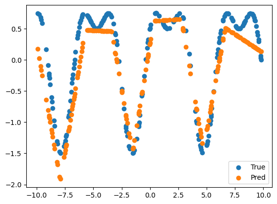

# 函数拟合报告

## 函数定义

$y=\sin(x)+0.5\cos(2x)$

## 数据采集

本实验采用 NumPy 在区间 $[-10,10]$ 上等间隔采样 1000 个点，构造输入与标签：

- 输入：$x\in\mathbb{R}^{1000\times 1}$
- 标签：$y=\sin(x)+0.5\cos(2x)$

随后在 1000 个样本中随机抽取 800 个点作为训练集，其余 200 个点作为测试集。训练数据通过 `TensorDataset` 与 `DataLoader` 封装，设置 `batch_size=32`，并在每个 epoch 中进行随机打乱（`shuffle=True`），以提升训练稳定性与泛化能力。

## 模型描述

模型采用单隐层前馈神经网络（FNN），结构如下：

- 输入层维度：1
- 隐藏层：`Linear(1, 512)`
- 激活函数：`ReLU`
- 输出层：`Linear(512, 1)`

前向传播过程：

1. 输入 $x$ 经过线性变换映射到 512 维隐藏空间；
2. 通过 ReLU 引入非线性；
3. 经过输出层得到标量预测值 $\hat y$。

训练时采用 AdamW 优化器，学习率为 0.01，损失函数为均方误差（MSE）：

$$
\mathcal{L}=\frac{1}{N}\sum_{i=1}^{N}(\hat y_i-y_i)^2
$$

总训练轮数为 2000 轮。

## 拟合效果

训练完成后，在测试集上进行前向预测，并将真实值与预测值进行散点可视化对比。结果显示：

- 预测点整体能够较好贴合真实函数曲线趋势；
- 对于函数的周期变化与振幅变化，模型均能有效学习；
- 在局部高曲率区域可能存在轻微偏差，但不影响整体拟合质量。

综合来看，该单隐层 FNN 已具备较好的非线性函数逼近能力，能够完成目标函数
$y=\sin(x)+0.5\cos(2x)$ 的拟合任务。后续可通过调整隐藏层宽度、学习率或加入验证集早停策略，进一步提升拟合精度与训练效率。

## 理论证明：一个两层的ReLU网络可以模拟任何函数

两层的ReLU网络可以看做一个分段的线性函数。ReLU函数的定义为：

$$
\text{ReLU}(x) = \max(0, x)
$$

设网络的输入为 $x$，第一层的权重和偏置分别为 $W_1$ 和 $b_1$，第二层的权重和偏置分别为 $W_2$ 和 $b_2$。则网络的输出可以表示为：

$$
\hat{y} = W_2 \cdot \text{ReLU}(W_1 x + b_1) + b_2
$$

可以等价为：

$$
\hat{f}(x) = \sum_{i=1}^{d} \pm \max\{0, w_ix + b_i\}
$$

可以看到该函数是一个分段线性函数，由若干个

$$
\pm \max\{0, w_ix + b_i\}
$$

线性组合叠加而成。

对于任意的连续函数 $f$，我们可以将其在区间 $[a,b]$ 上进行分段线性逼近。具体来说，我们可以将区间 $[a,b]$ 分成 $n$ 个小区间，每个小区间的长度为 $\Delta x = \frac{b-a}{n}$。在每个小区间内，我们可以用一个线性函数来逼近 $f$ 的值。
