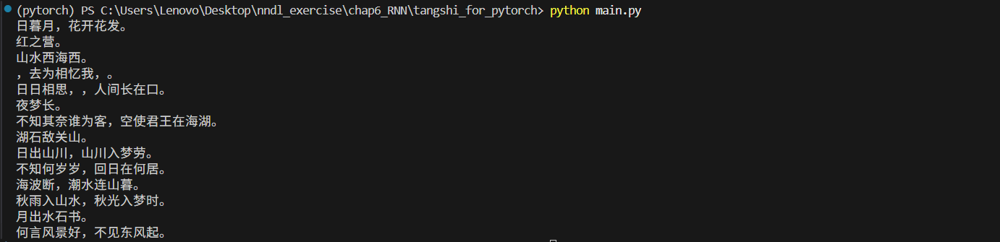
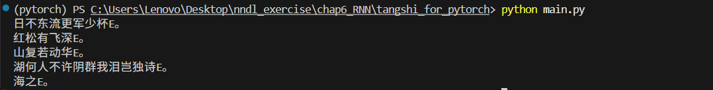

# 基于 PyTorch 的唐诗生成实验报告

## 一、实验任务

本次作业选择 PyTorch 版本，完成了诗歌生成程序补全，并基于循环神经网络进行中文古诗生成实验。

---

## 二、模型原理说明

### 2.1 RNN（循环神经网络）

RNN 通过隐藏状态在时间步之间传递历史信息，适合处理序列数据。设输入序列为 $x_t$，隐藏状态为 $h_t$，则基本形式为：

$$
h_t = f\left(W_{1}x_t + W_{2}h_{t-1} + b_h\right)
$$

$$
y_t = g\left(W_{3}h_t + b_y\right)
$$

其中，$h_t$ 依赖 $h_{t-1}$，因此网络具备时序记忆能力。RNN 的主要问题是长序列训练时容易出现梯度消失或梯度爆炸。

### 2.2 LSTM（长短期记忆网络）

LSTM 通过门控结构缓解普通 RNN 的长依赖问题，核心包括遗忘门、输入门、输出门和细胞状态 $c_t$。其思想是让模型学习“保留什么、遗忘什么、输出什么”，因此更适合文本生成任务。

优点：

- 更强的长程依赖建模能力。
- 在语言建模和生成任务上通常优于普通 RNN。

本实验的 PyTorch 实现中，核心循环层采用了 2 层 LSTM。

### 2.3 GRU（门控循环单元）

GRU 是 LSTM 的简化版本，将门控结构简化为更新门和重置门，没有单独的细胞状态。相比 LSTM：

- 参数更少，训练更快。
- 在部分任务上性能接近 LSTM。
- 适合算力较弱或需要更快训练的场景。

---

## 三、诗歌生成流程

### 3.1 数据预处理

1. 读取数据集：tangshi.txt/poems.txt。
2. 清洗样本：去除空格,过滤含有异常字符、过短或过长句子。
3. 在每条诗句首尾加入起始标记 G 和结束标记 E。
4. 构建字典（word_to_int）与反向字典（vocabularies）。
5. 将每首诗转换为索引序列，按长度排序并构建 batch。

### 3.2 训练样本构造

对每条序列构造输入 x 与标签 y：

- x 为原序列。
- y 为 x 左移一位后的序列（下一个字预测）。

这样构造数据集，可以使得模型基于前文信息来预测下一个字。

### 3.3 模型结构（PyTorch）

1. Embedding 层：将字索引映射到稠密向量。
2. 2 层 LSTM：提取上下文时序特征。
3. 全连接层：映射到词表大小。
4. LogSoftmax：输出各字符对数概率。

训练损失为 NLLLoss，优化器为 RMSprop，训练时使用梯度裁剪（clip_grad_norm）稳定训练。

### 3.4 训练与保存

1. 按 epoch 和 batch 循环训练。
2. 每个 batch 计算平均损失并反向传播。
3. 周期性保存模型参数到 poem_generator_rnn/poem_generator_rnn1。

### 3.5 生成过程

1. 输入开头字 begin_word。
2. 加载训练好的模型参数。
3. 将当前已生成序列送入模型，取最后一个时间步概率最大字符作为下一个字。
4. 重复迭代，直到生成结束标记 E 或达到最大长度。
5. 对输出做格式化打印，得到最终诗句。

---

## 四、生成结果展示

### 4.1 训练过程截图（PyTorch）

tangshi.txt 数据集训练过程截图：

poems.txt 数据集训练过程截图：

### 4.2 指定开头词生成结果

以下为题目指定开头词：日、红、山、夜、湖、海、月。

poems.txt 数据集生成结果：

| 开头词 | 生成结果 |
|---|---|
| 日 | 日暮月，花开花发。 |
| 红 | 红之营。 |
| 山 | 山水西海西，去为相忆我。日日相思，人间长在口。 |
| 夜 | 夜梦长。不知其奈谁为客，空使君王在海湖。 |
| 湖 | 湖石敌关山。日出山川，山川入梦劳。不知何岁岁，回日在何居。 |
| 海 | 海波断，潮水连山暮。秋雨入山水，秋光入梦时。 |
| 月 | 月出水石书。何言风景好，不见东风起。 |

tangshi.txt 数据集生成结果：
| 开头词 | 生成结果 |
|---|---|
| 日 | 日不东流更军少杯。 |
| 红 | 红松有飞深。 |
| 山 | 山复若动华。 |
| 夜 | null |
| 湖 | 湖何人不许阴群我泪岂独诗。 |
| 海 | 海之。 |
| 月 | null |

---

## 五、实验总结

本实验完成了 PyTorch 版本的诗歌生成代码补全，能够完成从数据处理、模型训练到文本生成的完整流程；通过字符级语言建模，模型学习到了常见诗句结构和词语搭配，具备一定古诗风格生成能力；LSTM 相比普通 RNN 对长依赖建模更稳定，是本任务中较合适的序列模型；同时实验也表明，生成质量受语料规模影响较大，在较小数据集（tangshi.txt）上生成结果较为简单，而在较大数据集（poems.txt）上生成结果更丰富多样。
